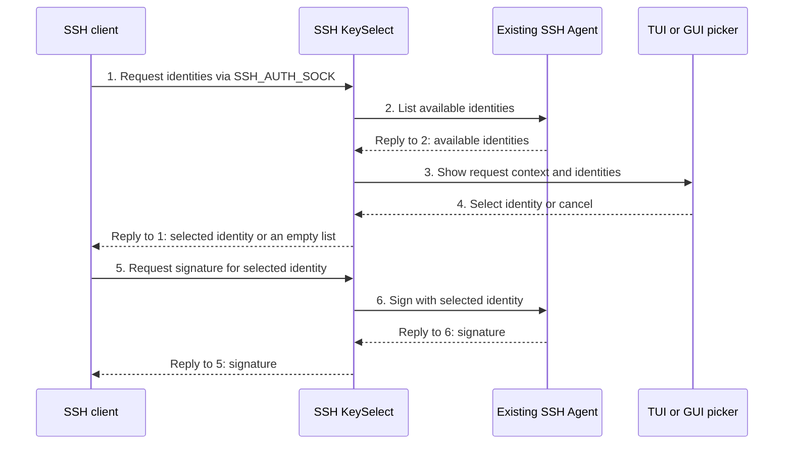
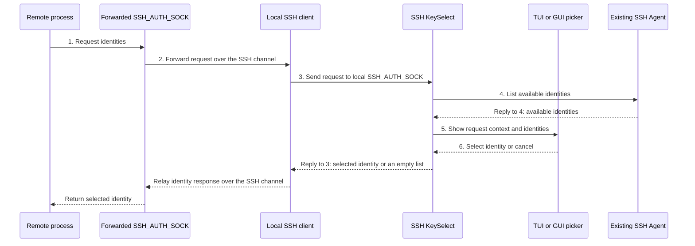

# SSH KeySelect

Selective SSH Agent Proxy

[](https://github.com/jfut/ssh-keyselect/releases)
[](https://github.com/jfut/ssh-keyselect/blob/main/LICENSE)

`SSH KeySelect` is an interactive SSH agent proxy that lets you choose which keys an SSH client can offer from your existing agent. Private keys stay in your existing agent, and the proxy rejects signing requests for unselected keys. This helps prevent unintended key use and reduces the risk of reaching an SSH server's `MaxAuthTries` limit.

> [!IMPORTANT]
> This project is experimental and under active development. Its interfaces, configuration options, and behavior may change as the project evolves.

## Installation

Download an archive for Windows, macOS, or Linux from [Releases](https://github.com/jfut/ssh-keyselect/releases). Each archive includes the standalone `ssh-keyselect-gui` application and `ssh-keyselect` for terminal use.

On RHEL-compatible Linux distributions, you can also download an RPM from [Releases](https://github.com/jfut/ssh-keyselect/releases) and install it directly, or configure the repository for DNF-managed installation.

To install a downloaded RPM:

```bash
dnf install ./ssh-keyselect*.rpm
```

To configure the repository, first install [dnf-plugin-anyrepo](https://github.com/jfut/dnf-plugin-anyrepo), then run:

```bash
rpm --import https://raw.githubusercontent.com/jfut/ssh-keyselect/refs/heads/main/RPM-GPG-KEY-jfut-github
dnf-anyrepo add https://github.com/jfut/ssh-keyselect
dnf install ssh-keyselect
```

## Quick start

### GUI: ssh-keyselect-gui

Start the GUI first, then set `SSH_AUTH_SOCK` to the Listen endpoint shown in its main window. On Linux and macOS, the default endpoint is `$HOME/.ssh/ssh-keyselect-agent.sock`.

For Git Bash ([Git for Windows](https://gitforwindows.org/)), macOS, and Linux:

```bash
ssh-keyselect-gui &
export SSH_AUTH_SOCK="$HOME/.ssh/ssh-keyselect-agent.sock"
ssh user@example.org
```

For Windows OpenSSH, set the GUI's Listen mode to Named Pipe. Its default endpoint is `\\.\pipe\ssh-keyselect-agent.socket`.

For Windows PowerShell:

```powershell
Start-Process .\ssh-keyselect-gui.exe
$env:SSH_AUTH_SOCK = "\\.\pipe\ssh-keyselect-agent.socket"
ssh user@example.org
```

For Windows Command Prompt:

```bat
start "" ssh-keyselect-gui.exe
set SSH_AUTH_SOCK=\\.\pipe\ssh-keyselect-agent.socket
ssh user@example.org
```

The GUI can start without an upstream agent. Open Settings from the gear button or File menu to configure the agent endpoints.

If you changed the Windows Listen endpoint in Settings, use the endpoint shown in the GUI instead of the default named pipe above.

The GUI's Auto Select control can temporarily expose all upstream keys without opening the picker. See [Auto Select](#auto-select) before enabling it.

### CLI: ssh-keyselect

Run OpenSSH through a temporary agent proxy. The picker appears in the current terminal, and the temporary endpoint is removed when SSH exits.

```bash
ssh-keyselect ssh user@example.org
ssh-keyselect ssh -p 2222 user@example.org
```

To use the picker for terminal commands named `ssh`, add an alias:

```bash
alias ssh='ssh-keyselect ssh'
```

Git can use the same command:

```bash
GIT_SSH_COMMAND='ssh-keyselect ssh' git clone git@example.org:owner/repo.git
git config core.sshCommand 'ssh-keyselect ssh'
```

For `scp` and `sftp`, use an executable wrapper that runs `ssh-keyselect ssh`, then pass its path with `-S`.

## Overview

### SSH connections from your machine

Many SSH clients that support the `SSH_AUTH_SOCK` environment variable use it to request identities and signatures from `SSH KeySelect` when connecting to an SSH server.
This includes direct use of `ssh` and OpenSSH launched by `git`, `rsync`, or the VS Code `Remote - SSH` extension.



OpenSSH uses the returned signature to authenticate to the SSH server.

### Through agent forwarding

With agent forwarding and Auto Select Off, a remote process such as Git or a nested SSH client uses its forwarded `SSH_AUTH_SOCK`. Its agent requests travel through the SSH connection to the local SSH client, then to SSH KeySelect.



Later signing requests and signature responses follow the same route. KeySelect forwards signing for the selected identity to the local agent; private keys stay on the local machine.

SSH agent forwarding keeps private keys on your machine, but lets a remote host request signatures from your agent. A malicious or compromised host can use forwarded keys to access SSH services and Git hosts reachable with your credentials, including reading or pushing to repositories. Forward your agent only to hosts you trust. See the [OpenSSH manual](https://man.openbsd.org/ssh) for its warning about agent forwarding.

## Shared behavior

### Endpoint modes

`--upstream-mode` controls how KeySelect connects to the existing agent. `--listen-mode` controls how the SSH client connects to the proxy.

|     Mode     |                              Endpoint                               |
| ------------ | ------------------------------------------------------------------- |
| `auto`       | Detect a compatible endpoint for the current shell and path.        |
| `unix`       | Unix-domain socket or Windows AF_UNIX socket.                       |
| `cygwin`     | Cygwin and Git for Windows socket files.                            |
| `wsl1`       | WSL1-compatible socket paths on Windows.                            |
| `named-pipe` | Named Pipe (Windows OpenSSH), such as `\\.\pipe\openssh-ssh-agent`. |

Both modes default to `auto` in the CLI and configuration. GUI Settings resolves an automatic listener mode to a concrete mode for display. Set a mode explicitly when connecting across shells or when automatic detection does not match the endpoint.

### Private key selection

The picker lets you choose a key available through the agent. The SSH agent protocol calls its selectable entry an `identity`: the public key and comment that identify the key the agent can use to sign. KeySelect forwards signing requests for the selected key to the upstream agent and never receives the private key material.

The picker shows each key's comment, key type, size in bits, and SHA256 fingerprint. Selection is scoped to an SSH session-binding chain:

- With Auto Select Off, a new connection starts a fresh selection. A forwarding hop that follows an authentication binding starts a new selection.
- The selected keys are cached for that chain. Signing requests for unselected keys are rejected.
- Canceling returns no keys to the SSH client.

See [the developer notes](docs/dev.md#agent-proxy-request-flow) for the request and connection flow.

### Request context

Both pickers show request context in selectable, copyable text. For accepted `session-bind@openssh.com` messages, the context includes verified host key types and fingerprints, plus whether each connection is marked as forwarded. Forwarding hops and the current target are grouped in a tree so connection boundaries are clear.

The agent protocol does not provide a hostname. Names matched from the default local `known_hosts` files are hints, not verified hostnames. If no session binding is available or accepted, the picker says that no verified host key was provided. Press Esc to cancel a request you do not recognize.

### Security and limitations

- The proxy supports listing identities, signing with selected identities, and verified OpenSSH session bindings. Key-management and unknown agent requests are always rejected.
- The proxy never stores private keys or signs data. It forwards signing requests for permitted identities to the upstream agent.
- The proxy cannot select keys based on a destination. Identity-listing and signing requests do not include the host, user, or port. A session binding can provide a signed host key, but not a hostname, user, or port.
- The proxy can only filter identities provided by the upstream agent.
- On Linux and macOS, Unix socket files use mode `0600`, and a created parent directory uses mode `0700`.
- Cygwin-compatible socket files use loopback TCP with a token stored in the socket file. Keep the file in a directory accessible only to your account.

## CLI

### Commands

|                          Command                           |                        Purpose                         |
| ---------------------------------------------------------- | ------------------------------------------------------ |
| `ssh-keyselect ssh [options] [--] [SSH arguments...]`      | Run OpenSSH through the terminal picker.               |
| `ssh-keyselect list [options]`                             | Print identities from the upstream agent.              |
| `ssh-keyselect test [options]`                             | Check the upstream agent and summarize its identities. |
| `ssh-keyselect version`                                    | Print the version and commit.                          |
| `ssh-keyselect --help` or `ssh-keyselect <command> --help` | Show commands and options.                             |

### Options and environment

The wrapper options go before `--`; arguments after it are passed to OpenSSH.

|             Command             |                                          Options                                          |
| ------------------------------- | ----------------------------------------------------------------------------------------- |
| `ssh-keyselect ssh`             | `--upstream`, `--upstream-mode`, `--listen`, `--listen-mode`, `--log-level`, `--log-file` |
| `ssh-keyselect list` and `test` | `--upstream`, `--upstream-mode`                                                           |

The terminal commands `ssh`, `list`, and `test` do not read TOML configuration files. Unless `--upstream` is set, they use the first non-empty value from `UPSTREAM_SSH_AUTH_SOCK`, then `SSH_AUTH_SOCK`. Paths support environment-variable expansion and a leading `~`.

### Logging

Logging is off by default. Pass `--log-level` to use `debug`, `info`, `warn`, or `error`.

For an SSH session, pass `--log-file FILE` to write KeySelect diagnostic logs to a file instead of the terminal:

```bash
ssh-keyselect ssh --log-level debug --log-file ~/ssh-keyselect.log -- user@example.org
```

The log file is replaced on each run and uses mode `0600` on Unix-like systems. OpenSSH output remains in the terminal. Review logs before sharing them; they can include SSH host key fingerprints and request metadata.

### Terminal picker

The terminal shows a blank line, `[ssh-keyselect - YYYY-MM-DD HH:MM:SS TZ]`, request context, and a cyan `Select an SSH key to allow:` prompt above the key table. The empty filter line shows a gray `Filter (If you don't recognize this request, press Esc to cancel.)` hint with the cursor at its start; the hint disappears when you type. Host details are indented beneath their tree labels.

|         Key         |              Action              |
| ------------------- | -------------------------------- |
| Type                | Filter the list.                 |
| Enter               | Select the highlighted identity. |
| Esc or Ctrl+C       | Cancel.                          |
| Backspace or Delete | Edit the filter.                 |
| Ctrl+U              | Clear the filter.                |

## GUI

### Linux runtime requirements

The Linux GUI requires X11 and OpenGL runtime libraries. Wayland sessions use XWayland.

### Command options

Run `ssh-keyselect-gui` to start the GUI. Its options are:

| Command             | Options |
| ------------------- | ------- |
| `ssh-keyselect-gui` | `--config`, `--listen`, `--listen-mode`, `--upstream`, `--upstream-mode`, `--log-level` |

### Configuration

The GUI reads TOML from `$XDG_CONFIG_HOME/ssh-keyselect/config.toml` when `XDG_CONFIG_HOME` is set. Otherwise, it uses the platform's user configuration directory:

| Platform |                                                Default path                                                 |
| -------- | ----------------------------------------------------------------------------------------------------------- |
| Windows  | `%APPDATA%\ssh-keyselect\config.toml` (usually `C:\Users\<user>\AppData\Roaming\ssh-keyselect\config.toml`) |
| Linux    | `~/.config/ssh-keyselect/config.toml`                                                                       |
| macOS    | `~/Library/Application Support/ssh-keyselect/config.toml`                                                   |

Use `--config FILE` to select another file. Command-line values override file values. The following environment variables also affect endpoint paths:

- `SSH_KEYSELECT_LISTEN` overrides `agent.listen`.
- When `agent.upstream` is empty, `UPSTREAM_SSH_AUTH_SOCK` takes precedence over `SSH_AUTH_SOCK`.
- Environment variables and a leading `~` are expanded in configured paths using the GUI process environment.

Remove the obsolete `[security]` section from older files. The configuration loader rejects unknown keys. Logging is off by default; set `log.level` in the TOML file or pass `--log-level` to enable it.

Example configuration for Git Bash on Windows, using a Cygwin-compatible listener:

```toml
[agent]
# Replace alice with your Windows user name:
upstream = 'C:\Users\alice\.ssh\ssh-upstream-agent.sock'
listen = 'C:\Users\alice\.ssh\ssh-keyselect-agent.sock'

# Linux/macOS:
# upstream = "$SSH_AUTH_SOCK"
# listen = "$HOME/.ssh/ssh-keyselect-agent.sock"

upstream_mode = "auto"
listen_mode = "cygwin"

[log]
level = "off"
```

### Cross-shell setup

When using Git Bash with endpoints from different environments, set the modes explicitly:

```bash
ssh-keyselect-gui --upstream-mode cygwin --listen-mode cygwin --upstream ~/.ssh/ssh-upstream-agent.sock &
export SSH_AUTH_SOCK="$HOME/.ssh/ssh-keyselect-agent.sock"
ssh user@example.org
```

### GUI controls

- Open Settings from the gear button or File > Settings. Apply activates endpoint changes immediately; use File > Save to store them.
- The File menu opens, saves, and saves as TOML configuration files. The GUI prompts before closing with unsaved changes.
- About shows the subtitle `Selective SSH Agent Proxy`, project URL, author `Jun Futagawa (jfut)`, and third-party libraries and licenses in selectable text. Select text and press Ctrl+C (Command+C on macOS) to copy it.
- Release archives include full license notices in `CREDITS`.

### Auto Select

Auto Select temporarily bypasses the per-connection picker. When On, the proxy returns every upstream identity and forwards signing requests for any of them. Any client that can access the proxy can then use every key in the upstream agent.

The GUI has Off and On controls beside Agent Proxy. On is red and requires confirmation. Use it only for trusted work, then turn it Off. The setting is temporary, is not saved in TOML, and applies to new identity requests. A client that already received all identities while Auto Select was On keeps that selection until its connection closes.

### GUI picker

The window title combines the action, application name, and local display time. The request-context area begins with the same timestamp followed by host details. It lets you scroll to earlier hops. Use the arrow keys to move through matches, Enter to select, and Esc to cancel.

The picker and main-window key table support copying a key. Right-click a key and choose Copy, or press Ctrl+C (Command+C on macOS), to copy its Comment, Type, Size, and Fingerprint as tab-separated text.

## License

Apache-2.0

Copyright contributors to the ssh-keyselect project.

## Author

Jun Futagawa (jfut)
