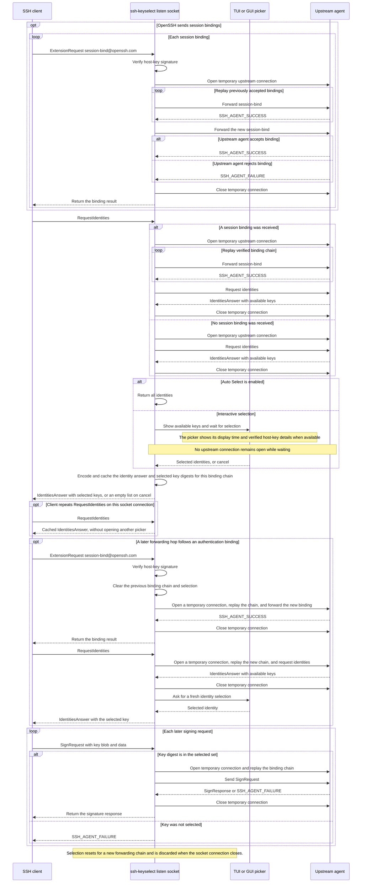

# Developer notes

`README.md` is the source of truth for user-visible CLI, output, configuration, and security guidance. This document covers package boundaries, implementation details including internal safeguards and resource limits, development commands, and release procedures.

## Architecture

- `cmd/ssh-keyselect` implements the CLI and terminal SSH wrapper.
- `cmd/ssh-keyselect-gui` implements the MyGo native UI, app lifecycle, endpoint configuration, status display, and About surface. It is built with the `gui` build tag and shipped beside the CLI executable.
- `internal/protocol` encodes and parses SSH Agent Protocol messages. `internal/agentproxy` exposes the selected identity and forwards permitted signing requests to the upstream agent.
- `internal/listener` and `internal/upstream` implement frontend and upstream transports. `internal/transport` provides their shared mode names and endpoint comparisons.
- `internal/selector` contains terminal and MyGo native identity pickers. Its selection interface always receives a `SelectionContext`, including an empty context when no host key was verified.
- `internal/guitable` shares identity table columns and alternating row styling between the main window and GUI picker.
- `internal/config` reads and writes GUI TOML configuration. CLI `ssh`, `list`, and `test` commands resolve upstream defaults from flags and environment without loading that file.
- `internal/credits` embeds the compact dependency list used by About. Full license texts are shipped in the root `CREDITS` file.

`config.Save` writes a mode-`0600` temporary file in the destination directory before replacing the destination. On Unix, the same-directory rename is atomic; Go does not guarantee atomic replacement on Windows. A failed write leaves the prior configuration intact, and a destination symlink is replaced rather than followed.

### Agent proxy request flow

OpenSSH may send session bindings before requesting identities and add bindings as forwarding hops are established. The proxy verifies the bindings and scopes the selected identities to the active chain; authentication later uses a separate signing request.



OpenSSH records session bindings for the lifetime of an agent connection and rejects a later binding on a connection already bound for authentication ([OpenSSH agent protocol](https://github.com/openssh/openssh-portable/blob/master/PROTOCOL.agent)).

The proxy opens a temporary upstream session for each bound operation and replays the verified binding chain before forwarding the request. This preserves session context for OpenSSH-compatible agents without holding a connection open while the picker waits. Without session bindings, ordinary requests use the upstream agent directly.

#### Selection cache

The proxy serializes each selected identity list once and retains it with the authorized key digests until the binding chain changes or the listen-socket connection closes.

- Repeated `RequestIdentities` requests on the same socket reuse the cached answer without opening another picker.
- Signing requests for selected keys in the same chain are forwarded. Requests for unselected keys are rejected.
- OpenSSH usually fetches the list while preparing public-key authentication; it does not poll periodically while a session is idle ([OpenSSH source](https://github.com/openssh/openssh-portable/blob/master/sshconnect2.c#L1543-L1571)).

#### Upstream request deadlines

Every upstream agent implementation supports opening a session. Identity-list and binding operations have a 10-second deadline, including connection establishment and binding replay.

Signing also limits connection establishment and binding replay to 10 seconds, but waits for the signature using the client connection's context. Upstream confirmation dialogs and hardware-key touch prompts can therefore stay open longer. Client disconnection or cancellation closes the upstream connection and interrupts the wait. Time spent choosing a key is excluded from upstream request deadlines.

Interactive identity selection has its own deadline. It starts after upstream identity listing completes and immediately before the selector is called; listing still has its independent 10-second request deadline. Selector requests are serialized, so time spent waiting in the selector queue counts toward the deadline and a request may expire before its picker opens. The GUI applies `agent.selection_timeout`; `ssh-keyselect ssh` accepts `--selection-timeout`. Both default to 120 seconds and accept 1 through 86,399 seconds. On expiry, the proxy returns an empty identities answer and closes the frontend connection to release its handler and reader.

The GUI picker derives the remaining seconds from the selection context deadline and invalidates its window once per second. When the request expires, it keeps the window open at `Timeout 0s` with a retry message, rejects selection and refresh actions, and releases the selector queue for a new request. Shutdown tracks and closes expired windows too. The terminal picker enforces the selection deadline without displaying a countdown.

### Display text sanitization

Upstream identity parsing validates the complete public-key blob with `ssh.ParsePublicKey`, including the algorithm, key fields, and trailing data, before deriving display metadata. Unsupported or malformed keys reject the identity response. Parsing errors do not echo untrusted algorithm text.

`internal/identity.DisplayText` replaces invalid UTF-8 with U+FFFD and maps Unicode control characters and characters with the [Bidi_Control property](https://www.unicode.org/Public/UCD/latest/ucd/PropList.txt) to ASCII spaces. This prevents public key metadata and local host hints from injecting terminal controls or explicit text-direction changes into surrounding UI text. Ordinary multilingual text, combining marks, and joining characters retain their spelling and glyph shaping.

This sanitizer is used for comments, algorithms, and fingerprints in:

- CLI identity tables and terminal picker rows.
- Native GUI key tables and their clipboard text.
- `known_hosts` hints in both pickers.

Sanitization applies to display strings; the identity retains the original agent comment for protocol responses. CLI and TUI tables cap comment columns at 36 characters, algorithm columns at 64, and fingerprint columns at 50. Truncation scans only to the column boundary and appends an ellipsis, preventing a single long comment from expanding every row's padding.

GUI endpoint export commands use POSIX single-quote escaping, including embedded apostrophes. Paths containing command substitutions, variable references, backticks, or backslashes remain literal when pasted into a POSIX shell.

### Terminal input lifecycle

The terminal picker serializes prompts and interrupts and joins each pending byte or line read before releasing its selection slot. This also applies to the speculative read used to distinguish Escape from a cursor-key sequence.

A standalone Escape stops input while keeping output and terminal modes available for the final newline. Full session cleanup follows before the selection slot is released. Unix terminals use nonblocking file descriptors; when a terminal read returns `EAGAIN`, the reader polls for input in bounded intervals. Stopping input interrupts that poll loop and expires the read deadline without closing the shared output descriptor.

Windows input reads run on a dedicated OS thread. Closing the session marks it stopped, cancels synchronous reads with `CancelSynchronousIo` and overlapped reads with `CancelIoEx`, and waits for the reader to exit before restoring console modes. Cancellation retries cover the interval immediately before a read starts. The worker's thread handle is protected until shutdown finishes, preventing cancellation from affecting a reused runtime thread. Git Bash/Cygwin inherited stdin remains open for later prompts and the SSH process.

### Frontend resource limits

#### Connections

Each proxy listener allows up to 128 concurrent client connections; additional connections are closed immediately. Admission counts each connection until both its request handler and frame reader have stopped.

Signing requests from separate client connections run concurrently through independent upstream connections. One client's approval wait does not block another client's signing request. Requests and responses within a client connection remain ordered.

#### Frames and request queue

Once a client starts sending an agent frame, it must finish within 10 seconds or the connection is closed. The read deadline starts after the first frame byte, is not extended by partial reads, and is cleared after a complete frame. It does not limit idle connections or time spent choosing a key.

Clients should wait for each response before sending another request. The frame reader runs separately so a disconnect or an incomplete-frame timeout can cancel an open picker. It queues at most one complete request and closes the client if another arrives while the queue is full, so delivery to the handler never blocks client monitoring.

Every reader exit cancels the connection context and closes the frontend socket to stop the picker and unblock response writes. Shutdown cancels pickers, closes frontend sockets, and waits for handlers and readers even when the listener fails.

#### Per-connection state

Each frontend connection accepts at most 16 session-binding requests and retains no more than 1 MiB of verified binding messages for its current chain. Starting a new forwarding chain clears the previous chain. The display-only `known_hosts` lookup reads at most 1 MiB from each file and stops scanning a file if a line exceeds 64 KiB.

#### Cleanup and runtime directories

Unix listener cleanup unlinks only the socket it created, after checking filesystem identity. Automatic unlinking on listener close is disabled so a replacement at the same path remains untouched.

Before replacing a stale Unix socket, the listener checks that the socket belongs to the effective user and rechecks its filesystem identity after the connection probe. Bind and permission failures also remove the path only when it still names the socket created by that listener.

Unix TUI endpoints use `XDG_RUNTIME_DIR/ssh-keyselect` when configured, or `os.TempDir()/ssh-keyselect-<effective UID>` otherwise. The XDG directory and the private directory must belong to the effective UID. The private directory is opened without following a symlink; ownership is checked before permissions are set to `0700` through the directory descriptor. This separates users in a shared temporary directory and avoids changing another user's directory permissions.

### Windows endpoint implementation

#### Endpoint transports and handshakes

The `cygwin` transport reads the socket file's endpoint information and connects through loopback TCP using the file's GUID handshake. The `wsl1` transport uses Windows AF_UNIX sockets with paths translated from `/mnt/<drive>/...`. The `named-pipe` mode uses Windows OpenSSH named pipes. Native Windows and shell-specific defaults are implemented in platform-suffixed files under `internal/listener`, `internal/upstream`, `internal/winpath`, and `cmd/ssh-keyselect-gui`.

Cygwin socket metadata reads are capped at 256 bytes. The listener accepts each connection immediately; its handshake then runs in the proxy's per-connection handler, after admission and before normal client logging or agent request handling. Connection reads and writes enforce authentication before passing agent traffic.

The Cygwin listener removes its metadata file on setup failure or shutdown only while the path still identifies the file it created.

Unauthenticated connections count against the proxy's 128-client limit, but their rejection does not generate client or overload logs. The transport also caps pending handshakes at 128 and closes excess connections. Each pending handshake expires 10 seconds after admission, even if connection I/O has not started. Authentication stops that timer without imposing a deadline on later signing approval waits. Dial cancellation interrupts the handshake, and listener shutdown closes every pending handshake immediately.

#### GUI configuration and shutdown

The CLI and GUI use the same endpoint comparison before binding. On Windows, native paths, Git Bash drive mounts, Cygwin `/cygdrive/` paths, and WSL1 drive mounts resolve through `internal/winpath`; named-pipe names and native paths compare without case sensitivity.

The GUI stores and displays paths in platform-specific formats. On Windows, dialog paths are converted to or from the selected transport when opening or saving configuration.

A Listen mode change closes and reopens the listener. If rebinding fails, it attempts to restore the previous listener.

Configuration application runs on a worker that serializes listener shutdown and restart. After successful application, it updates configuration and MyGo UI state on the UI thread. Configuration actions are disabled while application is pending.

The event loop stays available to finish cancelled picker tasks while server handlers drain. MyGo's `OnWillQuit` handler stops the selector, cancels the application context, and waits for server shutdown and owned socket cleanup before returning. Closing the native picker releases its waiting agent request so shutdown can finish while the UI loop is active.

At GUI startup, an existing filesystem entry at the resolved Listen path leaves the proxy unconfigured. The preflight check prevents the listener from removing or replacing an existing socket file.

### GUI rendering and memory

#### Rendering

The GUI uses MyGo's Go-only `ui` package. Views rebuild from application state, and virtualized tables create visible rows on demand. The main identity table reuses sorted rows between state changes. The picker reuses searchable identities and matches between query changes. Native windows do not start a WebView or load HTML or JavaScript.

MyGo draws the UI with Metal on macOS, Direct3D 11 on Windows, and OpenGL on Linux. Native file dialogs, menus, clipboard access, and tray integration use MyGo's platform APIs. Linux needs GTK 3 at runtime; tray integration additionally needs `libayatana-appindicator3`.

#### Settings layout

Settings sections use compact, content-sized layouts, and the Cancel/Apply footer centers its buttons in the remaining window height. `openSettings` sets a fixed `Height` and `MinHeight` for each platform, so adding or removing rows changes the vertical space around those buttons. When changing Settings items, update both window dimensions to account for the rendered content change and preserve the existing clearance above and below the footer. Keep the section gaps and padding consistent, and compare Windows, macOS, and Linux layouts because native title bars and macOS rounded edges change the available content area.

Before the MyGo event loop starts, `PathUserData` is set to the `ssh-keyselect` directory under the platform user configuration directory and that directory is created:

- Windows: `%APPDATA%\ssh-keyselect`
- macOS: `~/Library/Application Support/ssh-keyselect`
- Linux: `$XDG_CONFIG_HOME/ssh-keyselect`, or `~/.config/ssh-keyselect` when `XDG_CONFIG_HOME` is unset

On Windows, the key picker remembers the foreground window before opening and tries to restore it after the user closes the picker. Closing its owned modal window can activate the GUI's owner instead. On macOS, it records the frontmost app and reactivates it after AppKit finishes closing the sheet. On Linux/X11, the picker has no GUI-window owner, waits until the window is viewable before requesting native focus, traps X11 errors, and asks the window manager to activate the prior top-level X11 window after selection. Wayland compositors control cross-application activation, so the picker cannot force focus or restore another app there; GTK's normal present request is still used.

#### Logging

GUI logs use a stable writer so Settings can change the destination and level while the proxy is running. A configured file is appended with mode `0600`; missing parent directories are created with mode `0700`. An empty path uses stderr. Startup diagnostics retain only the latest 64 KiB, including when an individual write exceeds that limit, for the startup error message. Ongoing logging does not grow the diagnostic buffer or replay all logs at exit.

#### Memory measurements

Compare separate processes with the same configuration, display scale, and window size when measuring memory. On Windows, Task Manager's Memory column and a process's private bytes measure different things; collect both and distinguish startup peaks from idle use. Go heap profiles do not include native graphics allocations, so also check process memory when comparing builds.

### GUI assets

#### Asset generation

`assets/ssh-keyselect-logo.png` is the source artwork. `just gen-platform-icons` creates the multi-size ICO, Linux desktop PNGs, and macOS ICNS under the ignored `assets/gui/generated/` directory. The macOS ICNS uses ARGB payloads in its `ic04` and `ic05` 1x entries because macOS renders PNG payloads in the legacy `icp4` and `icp5` slots incorrectly. It also includes the 32px PNG in the `ic11` 16px Retina slot, the 64px PNG in the `ic12` 32px Retina slot, and 128px and 256px PNG representations for larger Finder sizes. `just gen-windows-icons` also generates ignored Windows `.syso` resources under `assets/gui/generated/windows/`.

Source artwork is decoded lazily once. The application icon supplies the native default, while windows use a shared 32px image for sharp title-bar icons; the tray icon is generated at its requested size.

#### Windows resources

Each Windows executable combines its icon and version information in one resource object because the Go linker accepts only one resource section per executable. The resource files are `assets/gui/windows-cli-resources.json` and `assets/gui/windows-gui-resources.json`. They define the shared `SSH KeySelect` file description and product name, project copyright notice, and each executable's original filename.

Windows version resources use `go-winres`, pinned in `scripts/generate-windows-icons.sh` and `scripts/generate-windows-resource.sh`. GoReleaser's per-target hooks use the latter script to set both executables' file and product versions to `.Version`, then remove the temporary resource after each build. Local builds use `0.0.0.0`. The GUI resource description also supplies its `SSH KeySelect` name in Task Manager.

The main window title and tray tooltip include the displayed active Listen endpoint followed by ` - SSH KeySelect`. Both labels are refreshed when the Listen endpoint changes in Settings.

#### Build handling

Because Go includes `.syso` files from a package directory, `just build`, `just snapshot`, `just release`, and release CI temporarily stage copies in the command directories and remove them after building.

Jun Futagawa (jfut) generated the logo with ChatGPT and edited it in Adobe Photoshop. The project distributes the final artwork and its derived application icons under the repository's Apache-2.0 license.

## Development commands

```bash
just update
just lint
just test
just build
just snapshot
```

### Tests

`just test` runs the non-GUI suite and the GUI-tagged tests. For focused work, use `go test ./path/to/package` or `go test -tags gui ./path/to/package`. Tests requiring OpenSSH binaries or platform transports depend on the environment or operating system.

Frontend connection-limit tests pass a cap of four connections to the shared serving implementation. They exercise admission, rejection, and slot reuse through real sockets without exhausting small file-descriptor budgets. Production `Serve` allows up to 128 connections.

Frontend timeout tests pass a 200 ms frame deadline to the shared serving and connection-handling implementation. They exercise cancellation and socket cleanup without waiting for the production `Serve` deadline of 10 seconds. Each test supplies its own limits; no global limits are changed.

Signing approval tests pass a 200 ms upstream setup deadline and withhold approval for 300 ms. This checks that signing waits can exceed the setup deadline for both bound and unbound sessions, without waiting for the production 10-second deadline. The tests use real transport connections and verify cancellation when the client disconnects.

The GUI runtime integration check applies endpoint changes against real Unix sockets and verifies that the proxy moves to the replacement endpoint.

Linux terminal tests use a real pseudoterminal to check context cancellation, the final newline after Escape, and input handoff to the next reader. Windows terminal tests cover blocking inherited pipes and Go's overlapped pipes, checking that later input survives cancellation. The Unix foreign-directory permission test requires root and otherwise skips. It changes only a temporary fixture's owner.

### Dependency credits

Run `just deps-credits` after changing Go dependencies or supported target operating systems. It installs a pinned `go-licenses` into a temporary directory, scans Linux, macOS, and Windows builds with the GUI tag, and regenerates `internal/credits/dependencies.txt` and `CREDITS`.

The scanner reports GUI-tagged and platform-specific imports in each build. Check its output for new or changed licenses. The generated `CREDITS` includes third-party license texts for modules used by shipped targets.

## Release packaging

### Build outputs

The build commands have these effects:

- `just clean` removes `dist/`, generated platform assets, and temporary Windows resource copies in the command directories.
- `just build` creates local binaries and generated platform assets.
- `just snapshot` builds a local GoReleaser snapshot.
- `just release` runs GoReleaser without publishing.

Linux and Windows release archives contain both executables, `LICENSE`, and `CREDITS`. macOS archives contain the CLI executable, `SSH KeySelect.app`, `LICENSE`, and `CREDITS`; they omit the standalone GUI executable. Linux packages install the license files under `/usr/share/doc/ssh-keyselect` and install the GUI desktop entry and PNG icons.

The macOS GUI post-build hook creates `SSH KeySelect.app` for Finder launches. Separate Darwin build IDs let the macOS archive contain the CLI and app bundle without the standalone GUI executable. The bundle contains the GUI executable and icon. The current release workflow does not sign macOS artifacts with a Developer ID or notarize them, so Gatekeeper may block an app downloaded from a release. Windows release binaries embed their icon; the GUI executable uses the GUI subsystem.

### Publishing

The [release workflow](../.github/workflows/release.yaml) runs automatically when a `v*` tag is pushed. GitHub Actions checks out the tagged source, generates platform resources and third-party credits, then uses GoReleaser to build and publish the artifacts. Public [workflow runs](https://github.com/jfut/ssh-keyselect/actions/workflows/release.yaml) and [Releases](https://github.com/jfut/ssh-keyselect/releases) provide build and release history.

Published releases use GitHub's [immutable releases](https://docs.github.com/en/code-security/concepts/supply-chain-security/immutable-releases). After publication, attached assets cannot be added, replaced, or deleted, and the associated tag is locked to its commit while the release exists.

Release titles and notes remain editable. The steps below update the description and policy link without changing the distributed files.

RPM artifacts are signed by GitHub Actions using `RPM_SIGNING_KEY`; set `NFPM_PASSPHRASE` if the key requires a passphrase. The release flow is:

1. Run `git tag -s vX.Y.Z -m vX.Y.Z`.
2. Run `git push origin vX.Y.Z` and wait for the Release to be created.
3. Edit the created Release.
4. Press the `Generate release notes` button and edit the release notes.
5. Include the project description and `Code signing policy` link below in the release body.
6. Press the `Update release` button.

Use this text for the current unsigned releases and future release notes. It points users to the current policy without claiming that an unsigned release is signed:

```markdown
SSH KeySelect is an interactive SSH agent proxy that lets you choose which keys an SSH client can offer from your existing agent. Private keys stay in your existing agent.

## Code signing policy

See the project's [Code signing policy](https://github.com/jfut/ssh-keyselect/blob/main/CODE_SIGNING_POLICY.md) for the current Windows signing status, intended scope, and team responsibilities.
```

Before submitting the SignPath application, jfut must add this text to the latest published Release after the updated README is available on the default branch. Keep the policy link when editing generated release notes.

## Dependency license inventory

The application project uses Apache-2.0. The current shipped module graph includes Apache-2.0, MIT, and BSD-3-Clause packages.

The credits generator scans Linux, macOS, and Windows builds with the GUI tag. `CREDITS` includes full notices for the Go standard library and third-party modules.

The MyGo GUI relies on platform font facilities and no longer embeds the Roboto or DejaVu Sans Mono font files used by the Unison-based GUI. The current scan found no MPL-2.0 dependencies.

Review license changes against SignPath's [conditions](https://signpath.org/terms.html) whenever dependencies or target platforms change, then run `just deps-credits`.

The repository's top-level license does not establish rights to separately sourced media assets. Track provenance for icons, fonts, and other non-code resources independently.

## SignPath Foundation application

### Current status and preparation

The project is preparing an application; SignPath approval and Windows signing integration are not yet in place. The user-facing policy is in [CODE_SIGNING_POLICY.md](../CODE_SIGNING_POLICY.md), linked from the README. The developers has GitHub MFA enabled and will enable MFA on the SignPath account before using it. External contributions require his review, including changes to build scripts and CI configuration.

The current build and publication flow uses GitHub Actions and immutable releases as described in [Release packaging](#release-packaging). Windows Authenticode signing and SignPath-specific build verification and manual approval are not yet configured.

Before submitting the [application](https://signpath.org/apply.html):

1. Publish `CODE_SIGNING_POLICY.md` with its SignPath attribution, team roles, and privacy link, and append the release text above to the latest Release.
2. Check both Windows archive architectures for the CLI and GUI executables, `LICENSE`, and `CREDITS`. Check both executables' `ProductName` and fixed file/product version resources against the release tag.
3. Confirm that the current dependency inventory and release notices are available for all shipped targets, and check any license changes against SignPath's component licensing conditions.
4. Use the English application text below and verify its links and current status before submitting. Include public maintenance and usage evidence without overstating the project's adoption.

SignPath's conditions also call for verifiable project reputation. SSH KeySelect is a new project with limited public usage history. Refer to jfut's [public GitHub activity](https://github.com/jfut) and maintained projects such as [dnf-plugin-anyrepo](https://github.com/jfut/dnf-plugin-anyrepo) as background evidence, without presenting them as proof that SSH KeySelect has an established user base. Acceptance remains the Foundation's decision.

### Work after acceptance

These are future integration tasks, not features of the current release workflow:

- Enable SignPath MFA and configure the Authors, Reviewers, and Approvers roles to match the published policy.
- Connect verifiable GitHub Actions build artifacts to SignPath and restrict signing to this project's Windows CLI and GUI executables for amd64 and arm64.
- Enforce `ProductName = SSH KeySelect` and a consistent `ProductVersion` for all signed executables in each build through SignPath artifact metadata restrictions. The existing resource hooks already populate the product name and release versions; SignPath enforcement still needs to be configured.
- Require jfut's manual approval for every release signing request. Validate returned Authenticode signatures and generate checksums from the final signed archives. Keep the release as a draft until signing, validation, checksum generation, and all asset uploads are complete, then publish the immutable release.
- Update the README status and attribution only when signing is actually available, and identify the first signed release in its release notes. Continue shipping license notices and keep RPM signing documented separately.
