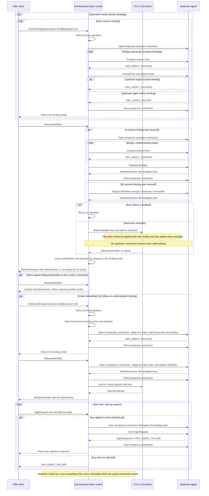

# Developer notes

`README.md` is the source of truth for user-visible CLI, output, configuration, and security behavior. This document covers package boundaries, implementation details, development commands, and release procedures.

## Architecture

- `cmd/ssh-keyselect` implements the CLI, terminal SSH wrapper, and companion GUI launcher.
- `cmd/ssh-keyselect-gui` implements GUI startup, endpoint configuration, status display, and the About dialog. It is built with the `gui` build tag and shipped beside the CLI executable.
- `internal/protocol` encodes and parses SSH Agent Protocol messages. `internal/agentproxy` exposes the selected identity and forwards permitted signing requests to the upstream agent.
- `internal/listener` and `internal/upstream` implement frontend and upstream transports. `internal/transport` provides their shared mode names.
- `internal/selector` contains terminal and GUI identity pickers. `internal/guiidentitytable` shares key-row presentation and filtering between the status window and picker.
- `internal/guiwindow` shares primary-display window placement between GUI surfaces.
- `internal/config` reads and writes GUI TOML configuration. CLI `ssh`, `list`, and `test` commands resolve upstream defaults from flags and environment without loading that file.
- `internal/credits` embeds the compact dependency list used by About. Full license texts are shipped in the root `CREDITS` file.

### Agent proxy request flow

The SSH client may provide session bindings before requesting identities, then add bindings as forwarding hops are established. After the user selects an identity, the client sends a separate signing request when authentication needs a signature. For each bound operation, the proxy opens an upstream agent connection, replays the verified binding chain on that connection, and sends the identity-list, binding, or signing request. It closes the connection after the response, so no bound upstream connection sits idle while the picker is open. When a later forwarding hop follows an authentication binding, the proxy starts a new binding chain and asks for a fresh selection.



OpenSSH records session bindings for the lifetime of an agent connection and rejects a later binding on a connection already bound for authentication ([OpenSSH agent protocol](https://github.com/openssh/openssh-portable/blob/master/PROTOCOL.agent)). The proxy replays the binding chain on each temporary upstream connection before sending that operation. This preserves the session context for OpenSSH-compatible agents while accommodating agents that close connections after a short idle period. Without session bindings, ordinary requests use the upstream agent directly.

The selected key digests stay authorized until the binding chain changes or the listen-socket connection closes. Later signing requests for a selected key in the same chain do not open another picker; requests for unselected keys are rejected. The repeated `RequestIdentities` branch covers clients that query again on the same agent socket. OpenSSH's usual authentication flow fetches the list while preparing public-key authentication; it does not poll periodically while an SSH session is idle ([OpenSSH source](https://github.com/openssh/openssh-portable/blob/master/sshconnect2.c#L1543-L1571)).

### Windows endpoint implementation

The `cygwin` transport reads the socket file's endpoint information and connects through loopback TCP using the file's GUID handshake. The `wsl1` transport uses Windows AF_UNIX sockets with paths translated from `/mnt/<drive>/...`. The `named-pipe` mode uses Windows OpenSSH named pipes. Native Windows and shell-specific defaults are implemented in platform-suffixed files under `internal/listener`, `internal/upstream`, `internal/winpath`, and `cmd/ssh-keyselect-gui`.

The GUI stores and displays paths in platform-specific formats. On Windows, dialog paths are converted to or from the selected transport when opening or saving configuration. A Listen mode change closes and reopens the listener, attempting to restore the previous listener if rebinding fails.

At GUI startup, an existing filesystem entry at the resolved Listen path leaves the proxy unconfigured. The preflight check prevents the listener from removing or replacing an existing socket file.

### GUI rendering and memory

GUI startup defaults `UNISON_CPU_RENDERING` to `1` before `unison.Start`. Unison then creates windows without OpenGL contexts and presents rasterized pixels through the platform's CPU drawing path. A small, mostly idle agent window benefits from avoiding driver initialization and GPU context allocations. An explicitly set environment variable takes precedence, including `UNISON_CPU_RENDERING=0` to request OpenGL.

`internal/guistyle.Font` uses Segoe UI on Windows, Helvetica Neue on macOS, and Noto Sans on Linux, with Unison's embedded label font as the fallback when the primary family is absent. These keep the mostly Latin UI from retaining CJK faces at startup. Unison chooses additional faces when text actually contains missing glyphs, including Japanese key comments and paths. Refresh, settings, and copy buttons use vector icons to avoid loading font faces just for symbols. Canvas retains loaded faces and parses their glyph tables eagerly, so selecting a CJK family for every label can dominate memory use even with CPU rendering. Go garbage collection cannot release those live faces. System font discovery can still cause a temporary startup peak while inspecting installed fonts.

Compare separate processes with the same configuration, fonts, display scale, and window size when measuring memory. On Windows, Task Manager's Memory column and a process's private bytes measure different things; collect both and distinguish startup peaks from idle use. Go heap profiles do not include native graphics-driver allocations, so also check process memory and loaded graphics libraries when comparing rendering modes.

A user-reported Windows check of a `just snapshot` build, with the main window visible 15 seconds after launch, measured 101.3 MB when launched by double-click and 97.6 MB with `UNISON_CPU_RENDERING=1`. The earlier 0.0.2 build measured 259.8 MB at startup with CPU rendering requested. These observations come from one environment; both updated launch methods request CPU rendering when no environment override is present, so the difference between them does not establish an additional benefit from setting the variable explicitly.

### GUI assets

`assets/ssh-keyselect-logo.png` is the source artwork. `just gen-platform-icons` creates the multi-size ICO, Linux desktop PNGs, and macOS ICNS under the ignored `assets/gui/generated/` directory. `just gen-windows-icons` also generates ignored Windows `.syso` resources under `assets/gui/generated/windows/`.

Each Windows executable combines its icon and version information in one resource object because the Go linker accepts only one resource section per executable. `assets/gui/windows-cli-resources.json` and `assets/gui/windows-gui-resources.json` define the shared `SSH KeySelect` file description and product name, the project copyright notice, and each executable's original filename. Windows version resources use `go-winres`, pinned in `scripts/generate-windows-icons.sh` and `scripts/generate-windows-resource.sh`. GoReleaser's per-target hooks use the latter script to override both executables' file and product versions with `.Version`, then remove the temporary resource after each build. Local builds use `0.0.0.0`. The GUI's resource description also supplies its `SSH KeySelect` name in Task Manager.

The main window title and tray tooltip include the displayed active Listen endpoint followed by ` - SSH KeySelect`. Both labels are refreshed when the Listen endpoint changes in Settings.

Because Go includes `.syso` files from a package directory, `just build`, `just snapshot`, `just release`, and release CI temporarily stage copies in the command directories and remove them after building.

The icon source currently has no recorded provenance or license metadata in this repository. Confirm that the project has redistribution rights and record its source/license, or replace it with a project-created asset, before publishing binaries.

## Development commands

```bash
just update
just lint
just test
just build
just snapshot
```

`just test` runs the non-GUI suite and the GUI-tagged tests. For focused work, use `go test ./path/to/package` and `go test -tags gui ./path/to/package`. Tests requiring OpenSSH binaries or platform transports are environment or OS specific.

Run `just deps-credits` after changing Go dependencies or the supported target operating systems. It installs a pinned `go-licenses` into a temporary directory, scans Linux, macOS, and Windows builds with the GUI tag, and regenerates `internal/credits/dependencies.txt` and `CREDITS`. The scanner is used because it can report GUI-tagged and platform-specific imports in each build. Check the output for newly introduced or changed licenses. The generated `CREDITS` includes third-party license texts and the licenses for fonts embedded by Unison.

## Release packaging

`just clean` removes `dist/`, generated platform assets, and any temporary Windows resource copies in the command directories. `just build` creates local binaries and generated platform assets. `just snapshot` builds a local GoReleaser snapshot. `just release` runs GoReleaser without publishing.

Release archives contain both executables, `LICENSE`, and `CREDITS`. Linux packages install `LICENSE` and `CREDITS` under `/usr/share/doc/ssh-keyselect` and install the GUI desktop entry and PNG icons. macOS archives include an application bundle. Windows release binaries embed their icon and use the GUI subsystem for the GUI executable.

RPM artifacts are signed by GitHub Actions using `RPM_SIGNING_KEY`; set `NFPM_PASSPHRASE` if the key requires a passphrase. The release flow is:

1. Run `git tag -s vX.Y.Z -m vX.Y.Z`.
2. Run `git push origin vX.Y.Z` and wait for the Release to be created.
3. Edit the created Release.
4. Press the `Generate release notes` button and edit the release notes.
5. Press the `Update release` button.

## Dependency license inventory

The application project uses Apache-2.0. Third-party modules include MIT, BSD-2-Clause, BSD-3-Clause, and MPL-2.0 licensed packages; the compact About inventory and full notices are regenerated from the module graph for every shipped target. No source modifications to the MPL-2.0 dependencies are currently included. Keep their license notices in `CREDITS` when redistributing binaries.

The repository's top-level license does not establish rights to separately sourced media assets. Track provenance for icons, fonts, and other non-code resources independently.
